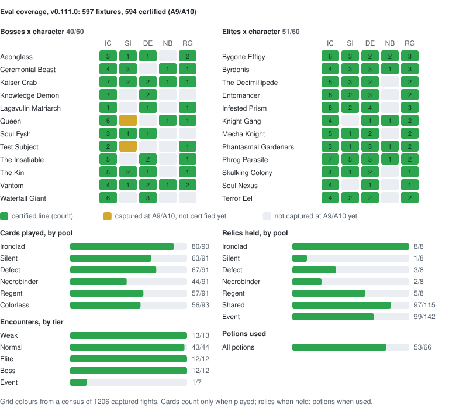

# v0.111.0 eval fixture set


Real captured fights, build-keyed like the simulator (`sim/meta/SIM_VERSIONING.md`).
This is the standing input to solver-quality work: sub-issue B writes optima
(`expected.json`) here, sub-issue C measures perf on the same roots, and the
port programme reads the census for its demand map (#2048, #1283, #1282).

**Since the 2026-09-16 authority flip (#1282, D1) this tree is the
certification, not a sample of it: Rust engine correctness means lockstep
against the capture's own per-action checksums, measured on the release
binary** — not parity with Python, which is advisory on v0.111.0 only.

## Coverage



`eval_coverage.py` measures how much of fight-space the **certified** lines
cover. Each axis has one rule for "exercised": a card counts once it is
**played**, a relic when **held** entering a fight, and a potion when **used**.
Encounters are counted per tier.

The grid crosses every boss and elite with every character, empty or not;
that is the one cross product tracked, because the same boss plays
differently per class. An empty cell is coloured by why it is empty:

* **amber:** an A9/A10 capture exists but doesn't certify yet (engine work);
* **grey:** nobody has captured it at A9/A10 yet (a fight to play).

The amber/grey split comes from the census the tree was seeded from. It needs
the local corpus, so it is stored in `coverage.json` and carried forward.

Outputs: `coverage.json`, `COVERAGE.svg`, `coverage-badge.svg`. `seed`
regenerates all three, re-measuring the split from its census, and `add`
regenerates them from the stored split. `test_coverage_artifacts_are_fresh`
fails when they are stale.

The reference lists are a snapshot, `coverage_universe.json`, because their
sources sit outside the solver trigger set:

* cards and their owning pool: `data/cards.json`, and
  `data/game_values.json` `colors`, from the game's `AllCardPools`;
* relics: `data/relics.json`;
* potions and encounter titles: `data/loc_en.json`;
* encounters and tiers: `engine/ENCOUNTER_COVERAGE_CENSUS.json`.

Refresh the snapshot on a version bump:

```bash
python3 sim/v0.111.0/eval/eval_coverage.py                    # regenerate
python3 sim/v0.111.0/eval/eval_coverage.py --census C.json    # and re-measure the split
python3 sim/v0.111.0/eval/eval_coverage.py --refresh-universe # new build's lists
python3 sim/v0.111.0/eval/eval_coverage.py --check
```

## Layout

```
manifest.json                       every fixture: id, kind, categories, provenance, outcomes
fights/<opaque-id>/provenance.json  seed, node, encounter, character, ascension, build, sha256 pair
fights/<opaque-id>/entry.canonical.json   the sts-sim-canonical-v2 root
fights/<opaque-id>/human_line.json  canonical wire actions + a digest after each + terminal state
fights/<opaque-id>/refusal.json     for a refusal fixture: surface, class, verbatim detail, full blocker set
fights/<opaque-id>/capture.mcr.gz   the game's own replay of the fight, gzipped
fights/<opaque-id>/entry.save.gz    the save the fight is rooted from, gzipped
```

**The raw captures are published (#3592).** Every fixture stores the pair it
was built from: `capture.mcr.gz` is the game's `.mcr` replay, with the game's
checksum after every action, and `entry.save.gz` is the entry save. Each is
the exact file `provenance.json` names by sha256 (`capture_sha256`,
`save_sha256`, both of the uncompressed bytes), so `gunzip -c capture.mcr.gz |
shasum -a 256` prints the recorded hash. All 597 fixtures are Sean's own
fights. A fixture is still keyed by an opaque id rather than a file name.
`test_eval_suite.py` pins the contract: every line fixture has its pair, and
every stored file matches its recorded hash.

A save whose provenance carries `"entry_input": "--capture-run"` is an
imported upload's capture run (see `import-uploads` below), which the engine
roots with `--capture-run` instead of `--save`. An unpaired-capture refusal
has no entry save, so it stores the capture alone.

The 597 pairs are 75.1 MB raw and 14.1 MB gzipped.

## Re-checking against the game

```bash
cargo build --locked --release --manifest-path sim/v0.111.0/engine/Cargo.toml --bin sts-sim
python3 sim/v0.111.0/engine/tools/eval_suite.py census --fixtures
```

`census --fixtures` checks each stored file against its recorded hash, then
runs the census over the stored pairs: Rust's own entry and opening from the
save, the recorded line from the capture, and every native checkpoint the
capture carries. It reads nothing from `entry.canonical.json` or
`human_line.json`, so the result is the engine against the game's checksums,
not the engine against its own stored output. It prints the usual census
table, then one line comparing the result with the manifest, and exits
non-zero if any fixture misses the `lockstep` verdict the manifest records or
any stored file is missing or the wrong bytes:

```
stored pairs: 594 certified of 597 fixtures; the manifest records 594 certified: reproduced
```

The run takes about six and a half minutes, five of them in one Knights
fight (`f88b91747240e7af`, #3581); `--progress` reports every 50 fixtures.

That is the number a clone can reproduce. The manifest's own `census` block
(1,196 of 1,201 eligible, 1,206 fights) is the measurement over Sean's full
local corpus, which the fixtures were selected from and which is not
published. The 19 fixtures of run `ZXJ7WX1JHA04` were `add`ed afterwards from
an `import-uploads` of that run alone, so that block does not count them.

One thing the pair alone cannot say: an event-room fight's encounter is
recorded by a later save at the same node. For those fixtures (19 today) the
census takes the encounter from the fixture's `provenance.json`. A save that
can name its own encounter always does.

## Kinds and categories

* `line` — Rust admits the root and the recorded human line replays exactly
  through it. The `certified` category is the subset whose every native
  checkpoint agrees (below); the rest are the acceptance set for the slices
  that still disagree with the game.
* `refusal` — the fight refuses, and the fixture records where, earliest
  surface first: `capture-pairing`, `rust-entry`, `rust-opening`,
  `rust-load`, `rust-line` (a recorded input with no exact Rust action) or
  `rust-lockstep` (a native checkpoint disagrees). These are pins in both
  directions: a slice that lands one of these classes turns
  `test_uncertified_roots_still_refuse_for_the_recorded_reason` red and the
  set is re-seeded. Since the #2915 re-seed every refusal names a Rust
  surface; the frozen oracle's `python-entry` / `python-line` are gone.
* `node:monster` / `node:elite` / `node:boss` name the room kind, so a
  harness can pick the hard fights without reading provenance. Every
  character carries a boss and an elite human line, except the named gaps in
  `test_eval_suite.KNOWN_LINE_GAPS` (today: the Regent boss, #3020).
* `human` is the baseline tag that licenses a solver-versus-human statement.
  It covers every A9/A10 human line, for all five characters (Sean,
  2026-09-23, #2915). From 2026-09-05 until then it was A10 Ironclad only,
  because the other characters' captures were low-ascension. Every fixture
  carries its ascension, so a low-ascension gap can never be reported as a
  baseline.

## How a fight is certified (#2999)

Everything below runs on the Rust engine alone; `eval_suite.py` imports no
part of the Python simulator.

1. **Root.** `sts-sim entry --save --opening` builds the whole root — entry
   facts and the opening. It is never spliced: the capture's first checksum
   (`After player turn start`) is *compared* with it (`opening_checkpoint`,
   plus the per-stream `opening_rng_drift` / `opening_counter_drift` the I6
   net reads), so an opening that consumed the wrong draws shows up rather
   than being overwritten.
2. **Recorded line.** Every recorded input is resolved to one of Rust's own
   wire actions, in order, by the production review's resolver
   (`python/rust_replay.py`, #2988): the capture's own deal
   (`python/mcr_native.py`) authenticates each `combat_card_index`, target
   ids are creation ordinals, a non-representative uid is applied as
   recorded, and every PlayerChoice goes through `_selection`. The census
   adds the SetupPlayerTurn Innate/IMBUED deal inversion the frozen
   `mcr_replay._deal_uid_map` made, multi-card choices, and exact state
   restoration between trial selections. `human` is `exact` when every input
   resolves and the combat ends exactly where the inputs do.

   `human` is `truncated` (`human_class` `capture_truncated`, #3277) when the
   capture itself stops mid-fight. The inputs run out with Rust's combat
   still live, every completed-action checkpoint agreed and was consumed,
   and the capture's final checksum shows a living player and a living
   enemy. Then one of two shapes (`truncation_shape`) must hold.
   `after_completed_action`: that final checksum is the completed-action
   checkpoint of the last recorded input, compared against Rust's state
   after it. `inside_player_decision`: the last input is a card play or
   potion that Rust leaves pending a choice, and its completed-action
   checkpoint is absent from the file. Either way, natively the game was
   waiting on a decision the file does not carry. The row carries
   `prefix_lockstep` in place of a `lockstep` verdict: a partial line is
   never certified. A combat Rust keeps alive after a final checkpoint that
   shows every enemy (or the player) dead stays
   `diverged:combat_not_complete`, and so does one whose last input is an
   end turn or whose checkpoints disagreed: an end turn runs a native enemy
   turn the file does not show, and a disagreeing line is not proved to have
   reached the capture's final state.
3. **Lockstep.** Every completed-action checkpoint the capture carries is
   compared as the line goes (`rust_replay.NativeChecks`): player resources,
   the live monster roster, each pile's ids and upgrades, and all nine RNG
   streams, with the player's pets — Osty against `player.ally`, relic pets
   against their fixed 9999-HP state — compared rather than miscounted as
   monsters. `lockstep_ok` is the certification; `checkpoint_mismatch` names
   the step and the field; `no_native_checkpoints` marks a capture that
   predates them.

`human_line.json` records Rust's wire actions and the engine's own
`differential_digest` after each. The tree was re-seeded from the Rust
census by #2915, including the two hand-added Insatiable fixtures, which were
re-`add`ed. Every root, line and step digest is therefore Rust's own, and
`verify` reproduces all of them.

## Selection policy: A9/A10 only (#2915)

Sean, 2026-09-23: **the suite holds A9 and A10 fights only.** A low-ascension
human line is too easy a target to say anything about solver quality. The
A0–A1 Defect set had no certified boss, and it hid a review-search weakness
that a single A10 Defect run exposed. `seed` applies `SEED_MIN_ASCENSION` to
line and refusal fixtures alike, then selects:

1. certified fights, at most `SEED_CERTIFIED_PER_ENCOUNTER` per
   (character, encounter), plus any further certified fight whose root holds
   a card, enchantment, relic, potion or monster kind no fixture so far
   certifies (`content_kinds`), so the cap never drops the only witness of a
   kind;
2. every recorded death;
3. every boss and elite encounter per character that has an exact line
   (certified first), then the potion, per-character and per-node quotas;
4. one refusal fixture per surface/class.

A `truncated` capture (#3277) is neither: it has no exact line, and no engine
surface refused it. `seed` leaves it out, and `add` refuses to write it.

Fixtures `add`ed with an explicit `--encounter` are kept across a re-seed
when they meet the floor, since the census cannot re-derive them.

## Upload source: `import-uploads` (#2915)

The mod's uploader keeps every uploaded capture locally, in
`~/Library/Application Support/SlayTheSpire2/relay_the_spire_uploader/review_provenance/`,
together with the entry projection the review pipeline resolves it against.
`import-uploads` writes each resolved room fight into the corpus as a
watcher-shaped triple under `<captures>/uploads/`:

* `SEED-NNN_mcr_<sha>.mcr` holds the capture's exact bytes;
* `SEED-NNN_save_<sha>.save` holds the capture's own embedded run with the
  uploader's unlock state, built by `rust_review.replay_capture_run`. This is
  the same input prod reviews root with `sts-sim entry --capture-run`;
* `SEED-NNN_upload_<sha>.json` names the `.run` fight's encounter.
  `derive_encounter` reads it first, and its presence makes `entry_input`
  root the pair with `--capture-run` rather than `--save`.

Fights the watcher corpus already holds are skipped, as are event combats,
unresolved provenance, and entry projections the review adapter rejects
(`deck_props`, `deck_upgrade`, `relic_membership`…). Each is counted by name
in the report. Friends' uploads live only in prod `fight_review_provenance`
rows, which Sean exports; agents do not read them.

```bash
python3 sim/v0.111.0/engine/tools/eval_suite.py import-uploads
```

## Regenerating

```bash
# the standing corpus report (the "done per encounter" table)
python3 sim/v0.111.0/engine/tools/eval_suite.py census \
    --captures ~/sts2-captures --census-json /tmp/census.json

# re-seed this tree from the corpus, by the documented breadth policy
python3 sim/v0.111.0/engine/tools/eval_suite.py seed --captures ~/sts2-captures

# one fixture from one capture pair
python3 sim/v0.111.0/engine/tools/eval_suite.py add \
    --mcr PATH.mcr --entry-save PATH.save

# check every stored pair against its recorded sha256, re-derive every
# fixture from it, and check every fixture's labels against the current
# census (#3270)
python3 sim/v0.111.0/engine/tools/eval_suite.py verify

# store every fixture's pair from a corpus, found by sha256 (the #3592
# backfill; `add` and `seed` store the pair themselves)
python3 sim/v0.111.0/engine/tools/eval_suite.py store-captures --captures ~/sts2-captures
```

`add` and `seed` write `capture.mcr.gz` and `entry.save.gz` with the
fixture's documents.

`verify` makes three passes, and any finding from any of them exits non-zero.
It reads the stored pairs; `--captures DIR` locates each pair in a corpus by
sha256 instead, which also derives an event-room encounter from the corpus's
later save rather than from provenance.

0. **Stored pairs (#3592).** Every stored file must exist and be the bytes
   `provenance.json` records the sha256 of; a file provenance does not name
   is a finding too. Listed under `stored_pair_problems`. This pass needs no
   engine, and `test_eval_suite.py` runs it on every checkout.
1. **Digests. It re-derives each rooted fixture's root, recorded line,
   step digests and terminal state. This pass skips any fixture with no
   `entry.canonical.json`, so on its own it cannot see a stale label.
2. **Labels (#3270).** It rebuilds each fixture's census row through the
   code `add` uses (`pair_row`), then compares the fixture with what `add`
   would write from that row. The manifest entry is checked field by field:
   kind, categories, `rust_root`, `rust_refusal_class`, `lockstep`,
   `entry_digest`, the refusal's class/surface/detail, and the
   turns/actions/HP/won summary. Every fixture file is compared too.

The label pass covers every fixture, including explicit-capture-pair
fixtures (re-rooted with their recorded `--encounter`), refusal fixtures with
no root, and unpaired captures. It lists each difference as `id: file.field:
committed X != census Y` under `label_differences`. It never repairs a
fixture: refresh the ones it names with `add`, then regenerate the roster
pins and coverage census as below.

One kind follows `seed` rather than `add`. A fight whose line replays but
whose checkpoints disagree stays a `rust-lockstep` refusal while the census
still names that refusal. Once it certifies, the refusal label is a
difference.

`--no-labels` skips the label pass. `verify` needs a built engine, so the
fast gate does not run it: run it with your head's release binary before
opening any PR that can move a verdict. `STS2_EVAL_REDERIVE=1` runs it, the
`census --fixtures` comparison and an `add` round trip from
`test_eval_suite.py`.

Every command needs a built engine
(`cargo build --locked --release --bin sts-sim`; pass `--binary` to name
another), since `verify` now re-derives the root and the line through Rust
too. The `--root-with` flag is gone: the `python` and `rust` (Rust entry,
Python opening) root sources were retired with the simulator (#2999), and
Rust's own opening is the only root.

Anything that rewrites `manifest.json` (`seed`, `add`) relabels the Rust
crate's roster pins, which record each corpus fight's fixture id keyed on
`(seed, node)`, and moves the `fixtures` column of the encounter coverage
census. The `rust port` lane checks both against the committed manifest, so
regenerate them in the same PR. The roster pins' cases are frozen Python
`make_monsters` measurements since #2999, so only their labels move:
`gen_roster_pins.py --relabel` rewrites them from the manifest with no
simulator. A pooled fixture that no pinned case covers (a fight the re-seed
added after the freeze) is listed in that pool's `unpinned_fixtures`; the
`.mcr` census, not a Python roster, certifies it.

```bash
python3 sim/v0.111.0/engine/tools/gen_roster_pins.py --relabel
python3 sim/v0.111.0/engine/tools/encounter_coverage_census.py \
    --json sim/v0.111.0/engine/ENCOUNTER_COVERAGE_CENSUS.json \
    --markdown sim/v0.111.0/engine/ENCOUNTER_COVERAGE_CENSUS.md
```

[`../engine/OPENING_CENSUS.md`](../engine/OPENING_CENSUS.md) is the last run of
the Python-vs-Rust opening parity census, retired with its tool by #2999 and
kept as frozen data. Per-fight opening coverage on the Rust root alone is the
census's own `stage` column (`opening_refused` rows name why).

## Solver research pilot (2026-09-17)

`search/` contains frozen development manifests, per-seed results, replay
validation, and a Rust/Python transition-throughput comparison. See
[`search/README.md`](search/README.md) for commands, selection policy, and
limits. Insatiable fixture `f143c7e6993ed27c` is now included.

The result files there are **historical**: they record what the 2026-09-17
engine found and are not regenerated, so their witnesses no longer replay on
the current engine. `search/historical-reports.json` lists them, and
`../engine/tools/verify_search_suite.py` checks that each is still the frozen
file instead of replaying it.

**Terminology correction:** in the tree seeded before #2999 the `certified`
category and `provenance.checksummed` boolean do **not** establish complete
native checksum agreement. The former records Rust/Python digest lockstep;
the latter records use of the capture's opening checksum. A tree seeded by
the #2999 census means what "How a fight is certified" above says. Native certification remains the
required authority, but its result must be read separately. For Insatiable,
full native projection still refuses unprojected fields; the original human
line agrees on 33 limited numeric checkpoints and every Python/Rust action.
The generated alternatives still await in-game replay. An admitted root and
a passing human line do not guarantee coverage of every counterfactual path.

For a save missing the map's room kind, `add` accepts a paired, explicit
`--encounter ENCOUNTER.THE_INSATIABLE_BOSS --node-type boss`. Supply both from
capture/run evidence. The override is recorded in provenance and refuses a
conflicting encounter that can already be derived. With `--captures`,
verification locates capture pairs by content hash, including descriptively
named files.
